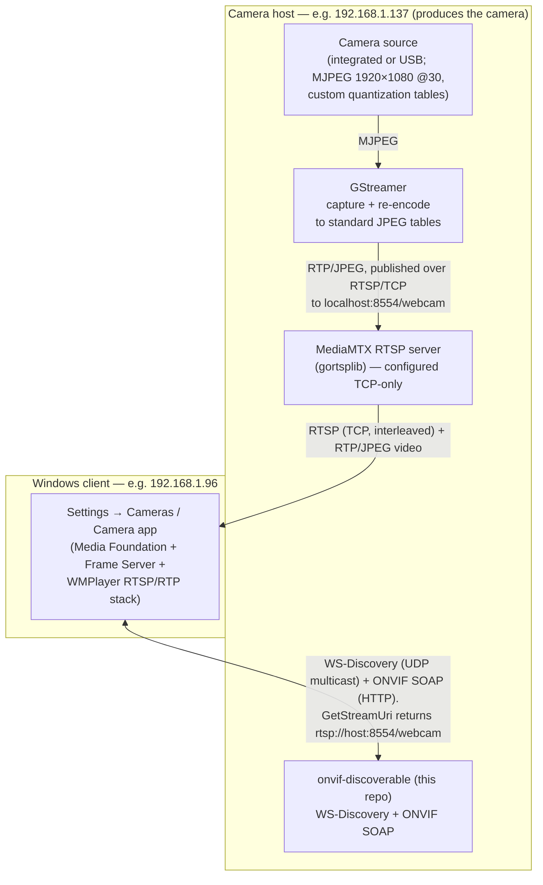

# Video streaming pipeline — end-to-end, and why it is the way it is

This document records the **complete working video pipeline** that makes a camera on one machine
show up as a network camera in Windows on another (the Settings → Cameras preview and the Camera
app), and — just as importantly — **why each piece is the way it is**. Most of this was discovered
the hard way; the intent is that a future contributor (or a fresh AI session) does not have to
rediscover it.

The "camera" can be **any video source available on the host** — an integrated camera, a USB
webcam, or anything else capturable — as long as it can be captured and served as an RTSP stream.
In the setup these notes were written against it is the **rear-facing integrated camera** of the
host device (it enumerates as `Microsoft LifeCam Rear`), but nothing in the pipeline is specific to
that; the same approach works for any RTSP-capable source.

`onvif-discoverable` (this repo) is only **one component** of the pipeline: it handles ONVIF
discovery and the device/media SOAP services. The actual video is produced and served by separate
tools (a capture/transcode process and an RTSP server). This document covers the whole chain so
the responder's behaviour makes sense in context.

> **TL;DR of the working setup:** camera (MJPEG, 1920×1080 @30) → **GStreamer** (re-encode to
> *standard* JPEG tables) → **MediaMTX** RTSP server (configured **TCP-only**) → Windows.
> `onvif-discoverable` advertises the device over WS-Discovery and answers ONVIF SOAP, pointing
> Windows at the RTSP URL with the codec set to `mjpeg`.

---

## 1. Architecture



**Host topology used during development** (yours will differ — these are concrete examples):

| Role | Host | Notes |
|------|------|-------|
| Camera + capture + RTSP server + `onvif-discoverable` | `192.168.1.137` ("SP3RED") | Everything that *produces* the camera runs here |
| Windows client doing discovery + preview | `192.168.1.96` ("IanG-P16") | Runs "Search for cameras" and the preview |

The two are different machines on the same LAN. (During development the Claude Code session ran on
a *third* machine that was neither of these — it could build the code but could not inspect the
camera host's files except via OneDrive sync.)

---

## 2. Running the whole pipeline

All three commands below run **on the camera host**. Replace `192.168.1.137` with that host's LAN
IP (use the **IP address, not the hostname** — see §4.2).

### 2a. RTSP server (MediaMTX) — configured TCP-only

Install [MediaMTX](https://github.com/bluenviron/mediamtx). In `mediamtx.yml` force TCP transport
(critical — see §6.3):

```yaml
# newer MediaMTX:
rtspTransports: [tcp]
# older MediaMTX used the name:
protocols: [tcp]
```

or via environment variable instead of editing the file:

```
MTX_RTSPTRANSPORTS=tcp      # newer
MTX_PROTOCOLS=tcp           # older
```

Then run `mediamtx`. It listens on `rtsp://0.0.0.0:8554/` and accepts published paths.

### 2b. Capture + re-encode (GStreamer)

Install GStreamer (see §5 for install gotchas) and run, **from PowerShell** (not Git Bash — see §5.1):

```powershell
.\gst-launch-1.0.exe ksvideosrc device-name="Microsoft LifeCam Rear" `
  ! "image/jpeg,width=1920,height=1080,framerate=30/1" `
  ! queue ! jpegdec ! queue ! videoconvert `
  ! "video/x-raw,format=I420,width=1920,height=1080,framerate=30/1" `
  ! queue ! jpegenc quality=80 `
  ! queue ! rtspclientsink protocols=tcp location=rtsp://localhost:8554/webcam
```

What each part does and why (full reasoning in §6):

- `ksvideosrc device-name="…"` — captures from the camera (integrated or USB). List devices with
  `gst-device-monitor-1.0 Video/Source` to get the exact name.
- `image/jpeg,…` — selects the camera's MJPEG mode at 1080p30 (the only mode that does full HD at
  high frame rate on this camera).
- `jpegdec ! videoconvert ! …,format=I420 ! jpegenc quality=80` — **decode and re-encode** the JPEG.
  This is the crucial step: it replaces the camera's *custom* quantization tables with **standard**
  ones, which is what Windows's JPEG/RTP decoder needs (see §6.1). `format=I420` (4:2:0) is required
  by the RTP JPEG payloader (see §6.2).
- `queue` between stages — runs each stage in its own thread so the live pipeline keeps up (see §6.2).
- `rtspclientsink protocols=tcp` — publishes into MediaMTX **over TCP** to avoid localhost UDP packet
  loss on the large 1080p frames (see §6.3).

This is an intra-only re-encode (one frame of latency), so it is **low-latency** — unlike H.264
transcoding, which we rejected for adding too much lag.

### 2c. ONVIF responder (this repo) — advertise as MJPEG

```powershell
dotnet run --project src/OnvifDiscoverable.Server/ -- `
  http://192.168.1.137:48554/onvif/device_service `
  rtsp://192.168.1.137:8554/webcam `
  "Sp3Red" "LifeCam" `
  mjpeg
```

Arguments: `<xaddrs-url> <rtsp-url> <name> <hardware> [codec]`. The **codec must match what the RTSP
stream actually carries** (`mjpeg` here; `h264` if you transcode to H.264). See §6.4 and the runtime
validator note in §7.4.

Before this works on a fresh Windows machine you will likely need the **urlacl + firewall**
one-time setup — the app prints the exact commands if it hits "access denied" (see §4.1).

### 2d. On the Windows client

Settings → Bluetooth & devices → Cameras → **Add a network camera** (or "Search for cameras"). The
device appears, Windows interrogates it over ONVIF, then connects to the RTSP URL over TCP and shows
live video. If it does not appear or fails, see the troubleshooting playbook in §7.

---

## 3. The ONVIF responder's role and the call sequence

Discovery is only the first step. When Windows previews the camera it makes this whole sequence of
calls (all handled by `OnvifHttpListener`), and only *then* opens RTSP:

1. **WS-Discovery** (UDP multicast `239.255.255.250:3702`): Windows sends a `Probe`; we answer with a
   `ProbeMatch` carrying the device's endpoint UUID, scopes, and **`d:XAddrs`** = the ONVIF *device
   service* URL. (`d:XAddrs` is **not** the RTSP URL — a common early misunderstanding.)
2. **Device service** (HTTP SOAP at `d:XAddrs`): `GetServiceCapabilities`, `GetSystemDateAndTime`,
   `GetDeviceInformation`, `GetHostname`, `GetNetworkProtocols`, `GetCapabilities`. `GetCapabilities`
   returns the **media service** URL (derived from `XAddrs` by swapping the last path segment for
   `media_service`).
3. **Media service** (HTTP SOAP): `GetVideoSources`, `GetProfiles`, `GetProfile`,
   `GetVideoSourceConfigurations`, `GetVideoEncoderConfigurations`, `GetVideoEncoderConfiguration`,
   `GetVideoEncoderConfigurationOptions`, `SetVideoEncoderConfiguration` (acknowledged but ignored),
   and finally **`GetStreamUri`**, which returns the RTSP URL.
4. **RTSP**: Windows connects to the returned URL and streams.

Windows calls these in bursts and repeats some (e.g. `GetHostname` twice, `GetDeviceInformation`
several times) — that is normal client behaviour, not an error.

See `docs/probe-match-checklist.md` (WS-Discovery conformance) and `docs/device-service-checklist.md`
(SOAP services) for the per-operation detail.

---

## 4. Windows discovery — the hard-won requirements

### 4.1 Firewall and URL ACL (http.sys)

`OnvifHttpListener` uses `System.Net.HttpListener`, which sits on the Windows **http.sys** kernel
driver. Two consequences on Windows:

- A non-admin process needs a **URL reservation**:
  `netsh http add urlacl url=http://<host>:<port>/onvif/ user=<DOMAIN>\<user>`.
- The inbound **firewall rule must target the port, not the executable** — because http.sys (PID 4,
  the System process) owns the TCP socket, an executable-based rule does not match:
  `netsh advfirewall firewall add rule name="ONVIF HTTP" dir=in action=allow protocol=TCP localport=<port>`.

The app detects the "access denied" (`HttpListenerException` error code 5) on `listener.Start()` and
prints both commands, then shuts the whole app down (it is useless without the HTTP service).

### 4.2 Use the IP address in `XAddrs`, not the hostname

If `d:XAddrs` uses a hostname, Windows must resolve it (and may append the local DNS suffix, e.g.
`HOST.lan`). That resolution often fails on a typical LAN. Advertising the **IP address** sidesteps
DNS entirely. (Symptom we saw: Windows received the ProbeMatch, did an ARP + DNS lookup for the
hostname, and then never connected.)

### 4.3 Responses must be schema-valid — Windows is a *strict* parser

Windows's ONVIF/WS-Management stack is **WWSAPI**, which does strict XML-schema validation and
**silently** rejects any non-conformant response with `WS_E_INVALID_FORMAT` (`0x803D0000`). Lenient
clients (ONVIF Device Manager, ffplay) tolerate the same mistakes, so a response can "work
everywhere except Windows."

Because of this we built **`OnvifSchemaValidator`** (see §7.4): every outgoing SOAP response is
validated against the bundled ONVIF/WS-* schemas at runtime, and violations are logged immediately.
Real bugs this caught:

- `IntRange` written with `Min`/`Max` **attributes** instead of child `<tt:Min>`/`<tt:Max>` elements.
- `GetVideoEncoderConfigurationOptions` missing the mandatory `QualityRange` (first child of `Options`).
- `GetServiceCapabilities` using a non-existent `FirmwareUpgrade` attribute (the real one is
  `CloudFirmwareUpgrade`).

### 4.4 Windows caches discovered cameras — bust the cache during development

Windows keys a discovered camera on its **endpoint UUID** (the device node is
`swd#networkcamera#urn:uuid:<uuid>`). A device that once failed onboarding leaves **stale negative
state** that blocks retries, even when the camera no longer shows in Settings.

Mitigations:
- `Program.cs` generates a **fresh random endpoint UUID on every run** (logged at startup), so each
  run looks like a brand-new device. *(For a real deployment this should instead be stable across
  reboots — see §8.)*
- Remove ghosted entries in **Device Manager → View → Show hidden devices** (under Cameras / Imaging
  devices / Network cameras), and in Settings → Cameras.

This caching, combined with a Windows update that tightened the WWSAPI parser, was responsible for a
baffling "it worked yesterday, now it finds nothing" regression.

---

## 5. GStreamer install gotchas (Windows)

- Use the official **MSVC 64-bit runtime MSI**, and choose the **Complete** setup type (the RTSP
  plugins — `rtspclientsink` — are not in the Typical install).
- Verify elements load: `gst-inspect-1.0 rtspclientsink`, `gst-inspect-1.0 jpegenc`.

### 5.1 The `giolibproxy.dll` / `gio-2.0-0.dll` failure

If GStreamer fails to start complaining it cannot load `giolibproxy.dll` ("The specified module
could not be found") even though the file exists, the real cause is a **missing/!shadowed
dependency** — usually a conflicting **MSYS2 (Git Bash) `glib`** on PATH. **Run GStreamer from
PowerShell, not Git Bash**, with GStreamer's `bin` first on PATH:

```powershell
$env:Path = "$env:LOCALAPPDATA\Programs\gstreamer\1.0\msvc_x86_64\bin;$env:Path"
```

`giolibproxy.dll` is only GIO's proxy resolver, which a local RTSP publish does not need; if it still
errors you can simply rename it so GIO skips it.

### 5.2 `rtpjpegpay`: "Invalid component"

The RTP JPEG payloader only supports RFC 2435's 4:2:0 and 4:2:2 with standard component layout. If
`jpegenc` negotiates some other subsampling you get "Invalid component" from
`gst_rtp_jpeg_pay_read_sof`. Fix: force the pixel format with `videoconvert ! video/x-raw,format=I420`
before `jpegenc` (as in the working pipeline).

### 5.3 "Pipeline construction is invalid, please add queues" + buffering/deadline warnings

A single-threaded capture→decode→encode pipeline cannot meet the real-time deadline. Insert `queue`
elements between stages (as in the working pipeline) so each runs in its own thread. The warnings are
non-fatal but the queues clear them and stop frame drops. `jpegdec qos=false` further stops
deadline-driven dropping if needed.

---

## 6. The MJPEG / RTP / Windows saga — why the pipeline looks like this

This is the part most worth preserving, because almost none of it is obvious.

### 6.1 Windows needs *standard* JPEG quantization tables; the camera used custom ones

Windows supports **MJPEG and H.264** for network cameras. We need MJPEG because the camera only does
full-HD/high-fps over MJPEG, and because MJPEG (intra-only) is far lower latency than H.264.

Symptom: with the camera's MJPEG passed straight through (`ffmpeg -c:v copy`), Windows displayed
**~1 frame per second** (clean images, just very infrequent), while ffplay/VLC on the *same machine*
ran at full rate.

Diagnosis (via Wireshark + inspecting a captured frame's DQT segments):
- RTP timestamps were perfect (3000 ticks/frame at 90 kHz = 30 fps) — **not** a pacing problem.
- The RTP JPEG header had **Q = 255** (RFC 2435 "dynamic" mode: quantization tables sent in-band).
- The camera's **luminance** quantization table was **custom** (a vendor-tuned table, *not* a scaling
  of the standard Annex-K table); its chrominance table was standard (~quality 80).

We initially suspected Q=255 itself. A controlled test (a GStreamer test pattern, also Q=255 but with
**standard** tables) played **smoothly** in Windows — proving **Q=255 is fine; the custom tables were
the problem.** WMP's JPEG/RTP decoder mishandles non-standard quantization tables (likely re-initialising
per frame and falling behind), dropping most frames.

**Fix: re-encode to standard tables.** `jpegenc` (and ffmpeg's MJPEG encoder) emit standard
Annex-K-scaled tables, which is exactly what WMP wants.

> Note on Q ≤ 99: RFC 2435's predefined-table mode (Q 1–99, no tables on the wire) is *only* valid if
> the encoder used the standard scaled tables. The camera's custom luminance table cannot be
> represented that way, so faithful pass-through *requires* Q=255. But this turned out not to matter —
> what WMP needs is **standard tables**, not a low Q value. Both ffmpeg and GStreamer always send
> Q=255 with tables in-band regardless; that is fine as long as the tables are standard.

### 6.2 Why GStreamer and not ffmpeg for the re-encode

ffmpeg *can* read the camera and re-encode, but its RTP/JPEG muxer is very picky about RFC 2435 and
its MJPEG encoder does not naturally produce what the muxer wants:

- `-c:v copy` preserves the camera's custom tables → the 1 fps problem.
- Re-encoding hit `RFC 2435 requires standard Huffman tables` → needs **`-huffman 0`** (the encoder
  defaults to *optimal* Huffman tables; RFC 2435 mandates standard ones).
- Then `RFC 2435 suggests two quantization tables, 1 provided` → at very high quality (`-q:v 4`) the
  luma/chroma tables collapse to one; a lower quality (`-q:v 10`) keeps them distinct.

A working ffmpeg incantation is roughly
`ffmpeg -f dshow … -c:v mjpeg -q:v 10 -huffman 0 -pix_fmt yuvj420p -f rtsp …`, **but** GStreamer
proved more reliable end-to-end (it produced the stream WMP demonstrably liked), so the working
pipeline uses GStreamer. `rtpjpegpay` also always emits Q=255 with in-band tables — fine, per §6.1.

### 6.3 Transport leg 1 (publish): localhost UDP loss → publish over TCP

`rtspclientsink` defaults to **UDP** even to localhost. Each 1080p JPEG frame is a burst of many
packets, and MediaMTX's UDP receive buffer overflowed — the server logged `RTP packets lost` and
`received wrong fragment`, and Windows stuttered on the resulting broken frames. **`protocols=tcp`**
on `rtspclientsink` makes the publish leg lossless (TCP flow-controls; negligible overhead on
localhost). This removed the server-side loss.

### 6.4 Transport leg 2 (consume): WMP's UDP is weak → force the server TCP-only

Even with a clean publish leg, the Windows camera app still stuttered, while **ffplay on the same
Windows machine over the same UDP was flawless**. So WMP's RTP-**over-UDP** receive path is the weak
link (small socket buffer / slow drain → it drops packets under bursty 1080p frames).

The transport is chosen by the **client** at RTSP `SETUP`, and WMP asks for UDP. You **cannot** force
it from ONVIF (we advertise `RTP_RTSP_TCP=true`, which only says "capable"). The trick that works:
**make the RTSP server refuse UDP** (`rtspTransports: [tcp]` in MediaMTX). WMP then falls back to
**RTP-over-RTSP/TCP (interleaved)**, which is lossless — and the stutter disappears. (Confirm in
Wireshark: WMP's `SETUP` gets `Transport: RTP/AVP/TCP;interleaved=0-1` and video flows inside the
RTSP TCP connection.)

This is the single change that took the result from "watchable but stuttery" to "full quality."

---

## 7. Diagnostics playbook

Tools and techniques that actually moved the investigation forward:

### 7.1 Wireshark
- **RTP timestamps**: at 30 fps with a 90 kHz clock they advance by 3000/frame. Flat/coarse → a
  pacing/timestamp problem (was *not* our issue).
- **RTP marker bit**: set on the last packet of a frame.
- **RTP JPEG header Q byte** (payload offset 5): `≤ 99` = predefined tables; `255` = in-band tables.
- **SETUP `Transport:` header**: shows UDP vs TCP/interleaved — how you confirm the §6.4 fix.

### 7.2 Inspecting a JPEG's quantization tables
Capture one frame preserving the original tables (`ffmpeg -i <src> -frames:v 1 -c:v copy cam.jpg`) and
parse its DQT segments; compare to the standard Annex-K tables (a custom table will not be a clean
scaling). This is how we proved the camera's luminance table was non-standard.

### 7.3 Windows-side logs
- **Device Manager → Show hidden devices**: find/remove ghosted `swd#networkcamera#urn:uuid:…` nodes.
- **Event Viewer → Applications and Services Logs → Microsoft → Windows → Media-Foundation
  (`MF-FrameServer/Camera_FrameServer`)**: shows the onboarding/streaming failures. Key codes seen:
  `0x803D0000` = `WS_E_INVALID_FORMAT` (schema-invalid SOAP response), `0xC00D4E24` = Frame Server
  watchdog timeout, `0x800706BE` = RPC failed (downstream of the parse failure). Enable the
  high-volume Analytic/Debug channels with `wevtutil sl <channel> /e:true`, reproduce, then
  `wevtutil sl <channel> /e:false` and `wevtutil qe <channel> /f:text > out.txt` (do **not** pass
  `/lf:true` with a channel name — that flag means the argument is a file path).

### 7.4 The built-in runtime schema validator
`OnvifSchemaValidator` compiles the bundled ONVIF/WS-* schemas (embedded under `Schemas/`) once at
startup and validates **every** outgoing response. A non-conformant response prints
`*** SCHEMA VALIDATION FAILED for response to '<action>' ***` with the schema errors and the offending
XML — turning Windows's silent `WS_E_INVALID_FORMAT` rejections into immediate, local feedback. If the
schema set fails to load, validation is skipped rather than blocking the server.

### 7.5 A lenient reference client
**ONVIF Device Manager** (free, third-party) uses a tolerant parser and fully streamed the camera
even when Windows would not — useful for proving the device service / RTSP path is fundamentally
sound and isolating the problem to Windows's strictness.

---

## 8. Known limitations / future work

- **Endpoint UUID is random per run.** Great for cache-busting during development, but a real device
  should derive a **stable** UUID (e.g. from a MAC address) so Windows recognises it across restarts.
  (Tracked in `docs/probe-match-checklist.md` item 3.)
- **Stubbed device metadata.** `GetDeviceInformation` returns placeholder `FirmwareVersion=1.0` and
  `SerialNumber=000000000001`; `SetVideoEncoderConfiguration` is acknowledged but ignored; the
  advertised resolution/framerate/bitrate are fixed at 1920×1080/30. These satisfy Windows but do not
  reflect real configurability.
- **Codec/stream coupling is manual.** The `[codec]` argument must be kept in sync with whatever the
  RTSP stream actually carries; there is no negotiation or detection.
- **AOT.** `OnvifSchemaValidator` uses `System.Xml.Schema`, which is a development aid; it degrades
  gracefully but may need gating before relying on an AOT `publish`.
